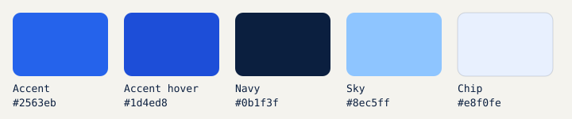
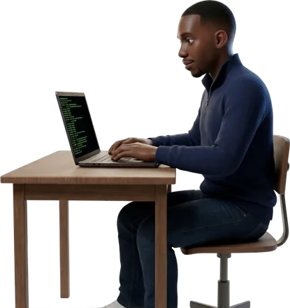

# 🎨 Brand Kit

The same identity as [josuejunior.fleuridor.com](https://josuejunior.fleuridor.com).
Use it for slides, profiles, posters and anything with my name on it.

---

## Palette

| Role | Hex | Swatch | Use it for |
|---|---|---|---|
| Accent | `#2563eb` |  | Links, buttons, highlights |
| Accent hover | `#1d4ed8` |  | Hover and pressed states, chip text |
| Navy | `#0b1f3f` |  | Body text, dark backgrounds, badge labels |
| Ground | `#f4f3ee` |  | Page background (warm, not pure white) |
| Sky | `#8ec5ff` |  | Links and accents on navy |
| Chip | `#e8f0fe` |  | Tag and skill chip backgrounds |

On dark backgrounds: navy ground, white text, sky for links.

## Fonts

All free on [Google Fonts](https://fonts.google.com).

| Font | Role | Weights |
|---|---|---|
| [Sora](https://fonts.google.com/specimen/Sora) | Headings | 500, 600, 700 |
| [IBM Plex Sans](https://fonts.google.com/specimen/IBM+Plex+Sans) | Body text | 400, 500, 600 |
| [JetBrains Mono](https://fonts.google.com/specimen/JetBrains+Mono) | Code, labels, numbers | 400, 500 |

## Avatar

I use a Pixar-style 3D avatar instead of a photo. That's on purpose.

| File | Use |
|---|---|
| [`hero-id.jpg`](../assets/avatar/hero-id.jpg) | Profile picture, square, 1024 × 1024 |
| [`hero-id-round.png`](../assets/avatar/hero-id-round.png) | Round-cropped portrait for READMEs (GitHub strips CSS), 400 × 400 |
| [`hero.webp`](../assets/avatar/hero.webp) | Full body, transparent background |
| [`pose-*.webp`](../assets/avatar/) | Career moments: student, terminal, teaching, laptop, certified, today |

**Rules**

- Always the avatar. Never a real photo, never a stock photo.
- Don't stretch, recolor or crop through the face.
- Round crop is fine for the square portrait.
- Leave breathing room around the full-body images; they sit on the ground color or navy.

## Tone of voice

- **Confident and concrete.** "4 servers at 99.98% uptime", not "highly reliable systems".
- **Numbers over adjectives.**
- **Short sentences.** One idea each.
- **Light emoji at most.** Mostly on headings, never mid-sentence.
- **Bilingual.** English and French are both first-class; Haitian Creole for community posts.
- **Private by default.** Talk about architecture, never about addresses, hostnames or secrets.

## Bios

### One line

- **EN:** DevOps Engineer · Data Science Specialist. I build and secure Linux and Docker infrastructure, and teach engineers in Haiti to do the same.
- **FR :** Ingénieur DevOps · Spécialiste Data Science. Je construis et sécurise des infrastructures Linux et Docker, et je forme des ingénieurs en Haïti à faire de même.

### Three lines

**EN**

> DevOps Engineer at Devora, running 4 production servers at 99.98% uptime.
> 8+ years of Linux, Docker and web development; former university instructor with 500+ students taught in Haiti.
> CompTIA Security+, Network+ and Linux+ certified; researching data science for emerging markets.

**FR**

> Ingénieur DevOps chez Devora : 4 serveurs de production à 99,98 % de disponibilité.
> Plus de 8 ans de Linux, de Docker et de développement web ; ancien enseignant universitaire, plus de 500 étudiants formés en Haïti.
> Certifié CompTIA Security+, Network+ et Linux+ ; je travaille sur la data science pour les marchés émergents.

Longer versions for LinkedIn, X and talks: [bios.md](bios.md).

[← Back to home](../README.md)
